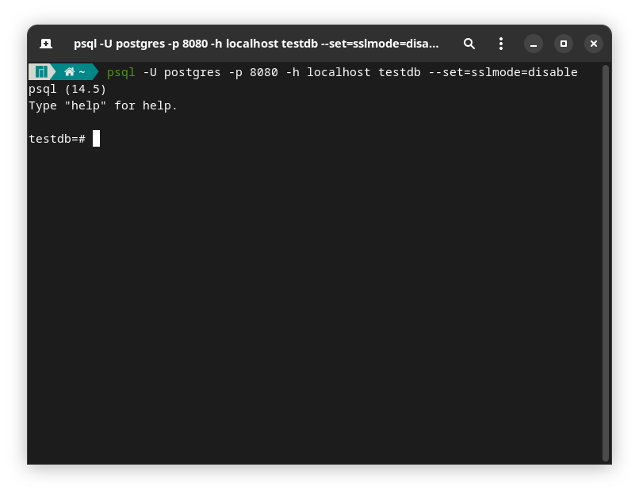
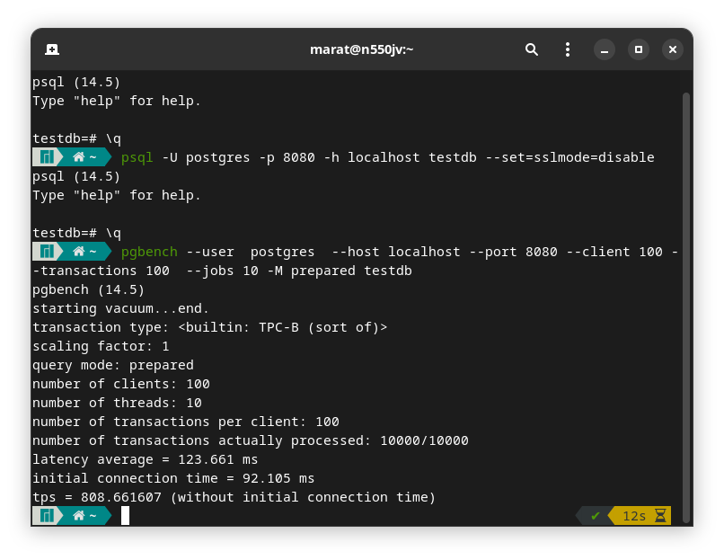

Запускаем сервер Postgresql по адресу `localhost:5432`

```sudo systemctl start postgres```
***
Запуск консольного клиента Postgresql через прокси сервер, который находится по адресу `localhost:8080`:

```psql -U postgres -p 8080 -h localhost testdb --set=sslmode=disable```



***
Результаты тестирования на 100 клиентах, по 100 транзакций на каждого клиента на 10 параллельных потоках (примерно по 10 клиентов на поток)

```
pgbench --user  postgres  --host localhost --port 8080 --client 100 --transactions 100  --jobs 10 -M prepared testdb
pgbench (14.5)
starting vacuum...end.
transaction type: <builtin: TPC-B (sort of)>
scaling factor: 1
query mode: prepared
number of clients: 100
number of threads: 10
number of transactions per client: 100
number of transactions actually processed: 10000/10000
latency average = 139.987 ms
initial connection time = 97.115 ms
tps = 714.352404 (without initial connection time)
```

(на изображении результаты тестирования за 13.10.2022, а в тексте за 12.10.2022)


также логи данного тестирования находятся в файле [ссылка на файл](pgbench_query_logs.txt)

***
данные компьютера:
```


 ██████████████████  ████████     
 ██████████████████  ████████     OS: Manjaro 22.0.0 Sikaris
 ██████████████████  ████████     Kernel: x86_64 Linux 5.15.71-1-MANJARO
 ██████████████████  ████████     Uptime: 1h 39m
 ████████            ████████     Packages: 1332
 ████████  ████████  ████████     Shell: zsh 5.9
 ████████  ████████  ████████     Resolution: 1920x1080
 ████████  ████████  ████████     DE: GNOME 42.3
 ████████  ████████  ████████     WM: Mutter
 ████████  ████████  ████████     WM Theme: 
 ████████  ████████  ████████     GTK Theme: Adw-dark [GTK2/3]
 ████████  ████████  ████████     Icon Theme: Papirus-Dark
 ████████  ████████  ████████     Font: Noto Sans 11
 ████████  ████████  ████████     Disk: 45G / 438G (11%)
                                  CPU: Intel Core i7-4700HQ @ 8x 3.4GHz [69.0°C]
                                  GPU: Intel Corporation 4th Gen Core Processor Integrated Graphics Controller (rev 06)
                                  RAM: 5168MiB / 15883MiB
```
***
Алгоритм работы прокси-сервера

1. настраиваем начальный сокет для прослушивания (чтобы подключались клиенты)
2. при помощи фунции poll (опрос сокетов на наличие событий) начинаем опрашивать каждый сокет.
3. если пришло событие от начального сокета, значит поключился новый клиент, добавляем его
4. если пришло событие от другого обрабатываемого сокета, считываем сообщение, если результат чтения -1, то отключаем клиент и его сервер, если все ок, то тут возможно 2 варианта
* если пришел запрос от клиента, и нет сервера, который подключен к этому клиенту, создаем сокет с подключением к серверу postgresql
* если сокет сервера уже подключен, то продолжаем
* отправляем серверу сообщение от клиента, если не получилось, от отключаемся от клиента и его сервера. 
* парсим сообщение и записываем его в логи. если пришло сообщение Terminate, то также отключаем клиента и сервер
5. если сообщение от сервера, то отправляем его клиенту и парсим сообщение. если не получилось, то отключаем их
6. после обработки цикла с сокетами, удаляем из прослушиваемых сокетов те, у которых fd==-1, т.е. их отключили.
7. также стоит проверять, если событие от сокета не POLLIN, а что-то другое, в этом случае нужно отключать клиента и сервер, но у меня это не реализовано
   
***

Алгоритм работы парсера
1. Есть функции parseB для парсинга сообщений от сервера и parseF от клиента
2. в классе, которых хранит парсеры, хранятся парсеры в словаре char->MessageParser. нужный парсер выбирается проверкой первого байта сообщения согласно протоколу https://www.postgresql.org/docs/current/protocol-message-formats.html
3. Выбранный парсер уже в соответствии с типом сообщения проводит парсинг и возвращает в виде std::string
